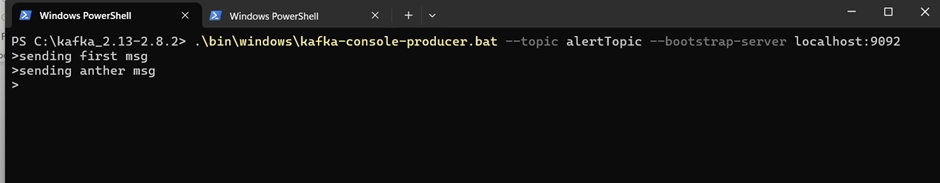
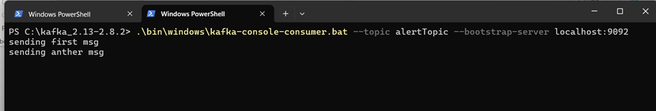
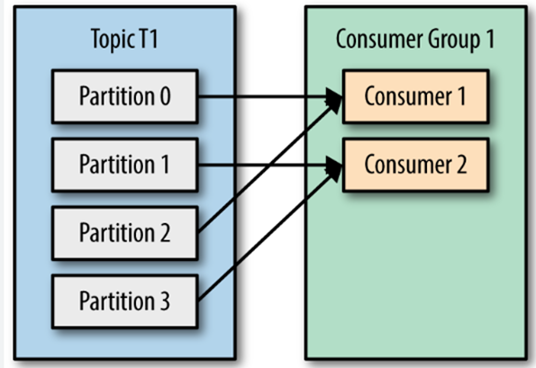
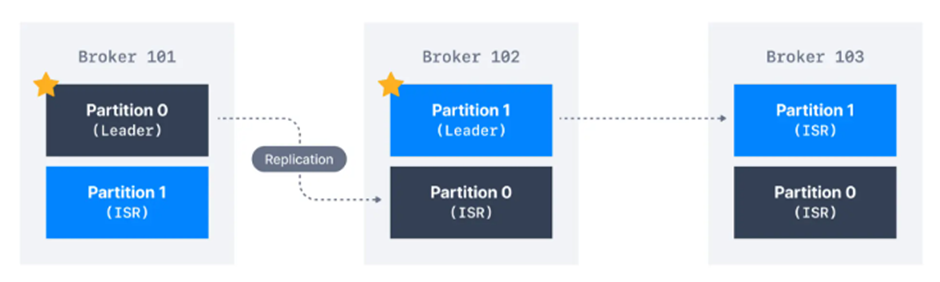

# KAFKA NOTES
## What is event streaming?
Event streaming is the practice of capturing real time data from applications, databases or IOT devices and transporting it to various destinations for immediate processing and storage.

## What is event streaming platform?
Platform/technology which helps to capture real time data from source application and transport it to destination for processing or storage.

## What is Apache KAFKA?
- Apache KAFKA is a distributed event streaming platform.
- It is used for :
    - High throughput: Process data faster
    - Fault tolerant: Data is replicated in multiple nodes. So, data will be available even if a node fails.
    - Scalable messaging: It can handle increasing messaging load using distributed design.
- Applications of Kafka:
    - Real time data processing
    - Logging
    - Event-driven architecture

## Key concepts
-	Producer: It sends events to KAFKA
-	Topic: It is a category to which event/data is sent.
-	Consumer: It reads events from KAFKA
-	Consumer group: It is set of consumers that collaborate to read events from KAFKA. It shares workload ensuring each event is consumed once by a single consumer group.
-	Partition: A topic can be divided into multiple segments. This is a fundamental unit of storage and parallel processing.
-	Broker: It is a server that stores, manages, and distributes events within KAFKA system. 
-	Zookeeper: It is central system which manages and coordinates KAFKA brokers (cluster). Stores metadata like broker registration, leader election and topic configurations. (In newer version zookeeper is not required).

## KAFKA normal workflow
1.	Producers sends events to KAFKA topic.
2.	This event is then get stored inside a partition of KAFKA topic.
3.	Each KAFKA topic is divided into number of partitions.
4.	Consumers reads these events from partitions.
5.	Events are retained for a configured time, even after being read.

## Local windows Setup –
1.	Download KAFKA
    - https://archive.apache.org/dist/kafka/2.8.2/kafka_2.13-2.8.2.tgz (Last jdk8 supported version)
    -   tar -xvzf kafka_2.13-2.8.2.tgz 
    -	cd kafka_2.13-2.8.2

2.	Start zookeeper
    - .\bin\windows\zookeeper-server-start.bat .\config\zookeeper.properties
    - Error: The input line is too long. The syntax of the command is incorrect.
    - Solution: Avoid keeping kafka folder inside nested folders. Keep it dicrectly inside under “c”. Otherwise it will give input line too long, means folder path is too long.

3.	Start KAFKA
    - .\bin\windows\kafka-server-start.bat .\config\server.properties

4.	Create KAFKA Topic
    - .\bin\windows\kafka-topics.bat --create --topic --alertTopic --bootstrap-server localhost:9092 --partitions 1 --replication-factor 1
    - CMD breakdown:
        - .\bin\windows\kafka-topics.bat: It is a script which creates topic.
        - --create: It specifies we want to create new topic.
        - --topic –alertTopic: Used to provide topic name
        - --bootstrap-server localhost:9092: It used to connect to kafka broker running on localhost:9092. Bootstrap server is how KAFKA client discovers brokers.
        - --partitions 1: Creates topic with 1 partition. Partitions allow KAFKA to distribute messages across multiple brokers for scalability. More partitions = high parallelism for consumers.
        - --replication-factor 1: Defines how many copies of data exist in cluster. 1 means no replication i.e., only one broker will store the data. In production use at least 2 or 3 to prevent data loss.
5.	Produce and consume events/messages using consle:
    - .\bin\windows\kafka-console-producer.bat --topic alertTopic --bootstrap-server localhost:9092

    

    - .\bin\windows\kafka-console-consumer.bat --topic alertTopic --bootstrap-server localhost:9092

    
6.	Stop KAFKA 
    - .\bin\windows\kafka-server-stop.bat

7.	Stop Zookeeper
    - .\bin\windows\zookeeper-server-stop.bat

## Important notes:
1.	In cluster environment each KAFKA broker starts using server.perperties. This file contains “zookeeper.connect” property. This property is used to connect with zookeeper which manages cluster. Every KAFKA broker connects with this zookeeper. Zookeeper then keeps track of every broker.
2.	KAFKA partitions and consumer group:
    - When consumer group has multiple consumers then each partition will be assigned to single consumer from that consumer group. 
    - Each partition will be assigned to single consumer from consumer group.
    - Multiple consumers cannot read from same partition. Only one consumer can read.
    - Single consumer can read multiple partition.
    - If consumer fails, KAFKA reassigns partition to other consumer.

    
3.	Different producers can send event/message on same partition.
4.	How to increase parallelism of producers
    - Increase the number of partitions to increase parallelism. Also, we can increase number of producers. Increase batch size to send more massages per batch. Use asynchronous send to avoid blocking. 
5.	acks=1 vs acks=all
    - acks=0: It means no acknowledgement. It is fastest.
    - acks=1: It means leader broker sends acknowledgment to producer as soon as event/message has written to its local log. It doesn’t wait for all the replicas to give the acknowledgment. That’s why this is faster but less reliable.
    - acks=all: It means leader broker waits for all the replicas to acknowledge the message before confirming it to producer. It is slower but more reliable.
6.	How to increase parallelism of consumers
    - Increase the number of partitions.
    - We can have 1 consumer per partition.
    - For 10 partition we can create max 10 consumers.
    - Separate out business logic into separate processor. User consumer to consume messages and pass them to worker threads (processor)
7.	If we have 2 consumer group, then both the consumer groups will consume the message.
8.	What is “Key” in KAFKA message
    - Key is used to determine partition.
    - KAFKA converts key into hash to determine partition. Partition = Hash(key)%numberOfParition
    - All the messages with same key will go to the same partition.
    - If no key is provided, KAFKA will distribute the message in round-robin fashion across all the partitions.
9.	Partition Replicas
    - Each topic is divided into multiple partitions.
    - Partitions are replicated across multiple brokers to prevent data loss.
    - For each partition one broker acts as a leader and other broker with replicas act as followers.
    - Leader handles all read and write requests.
    - Followers replicate data from leader to keep themselves in sync.
    - ISR (In-sync-replicas) is the list of replicas that are fully synchronized with the leader.
    - Only replicas in ISR are eligible for leader election in case of broker failure.
    - Replication-factor decides how many replicas per partition.
    - If replication-factor is 3 then 3 copies will exist for each partition.
    - More replicas mean more fault tolerant and high storage.
    - Less replicas mean less fault tolerant but faster and less storage.
    - For production environment replication factor should be >=3.

## Example: - How partitions will be created if 2 brokers are there with 2 partitions. 
Number of Brokers = 2  
Number of Partitions = 2  
Replication factor = 1  

Ans:  
- Broker 1:
    - partition0 (Leader, No replica)  
- Broker 2:
    - partition1(Leader, No replica)  

## Example: - How partitions and replicas will be created if 2 brokers are there with 2 partitions and 2 replication factor.
Number of Brokers = 2  
Number of Partitions = 2  
Replication factor = 2  
Ans:  
- Broker 1:
    - partition0 (Leader)
    - partition1 (Replica)

- Broker 2:
    - partition0 (Replica)  
    - partition1 (Leader)  

## Example: - Following is the 3 broker 2 partition and 3 replication factor configurations.

Please Note: Partition marked * is leader.