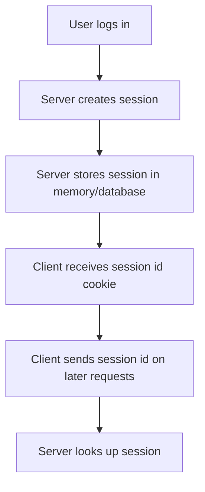
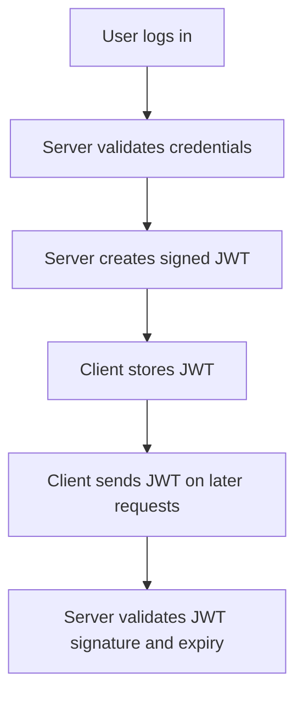
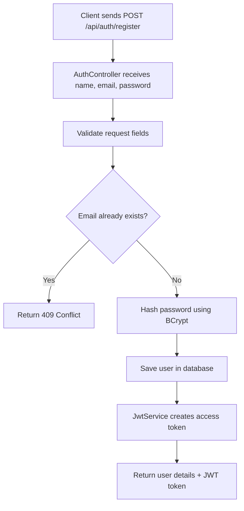
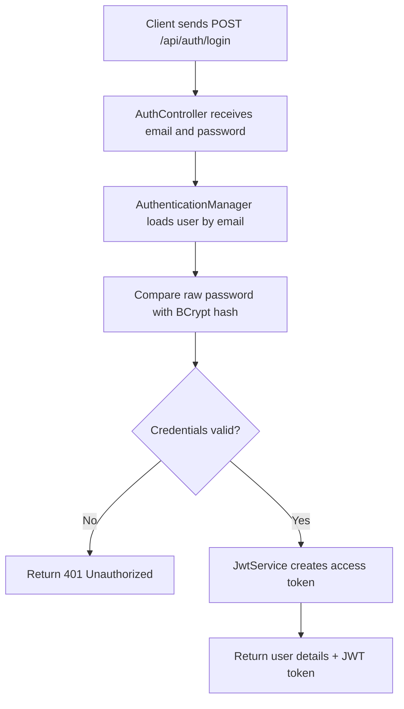
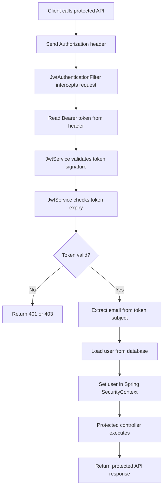
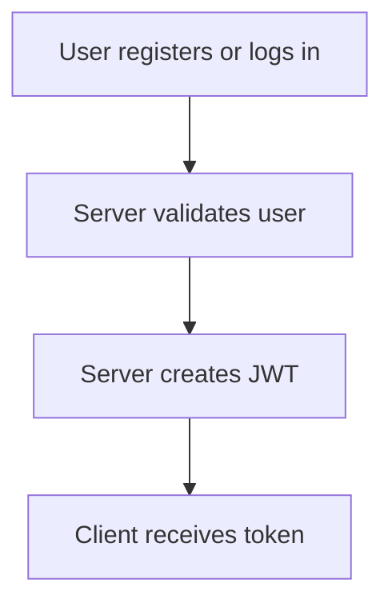
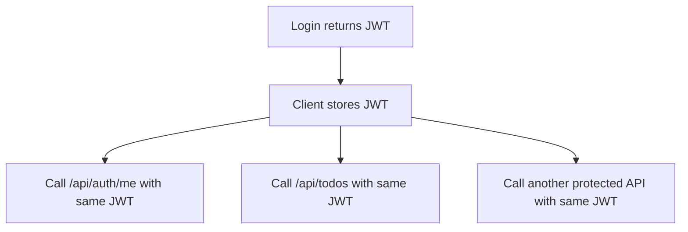
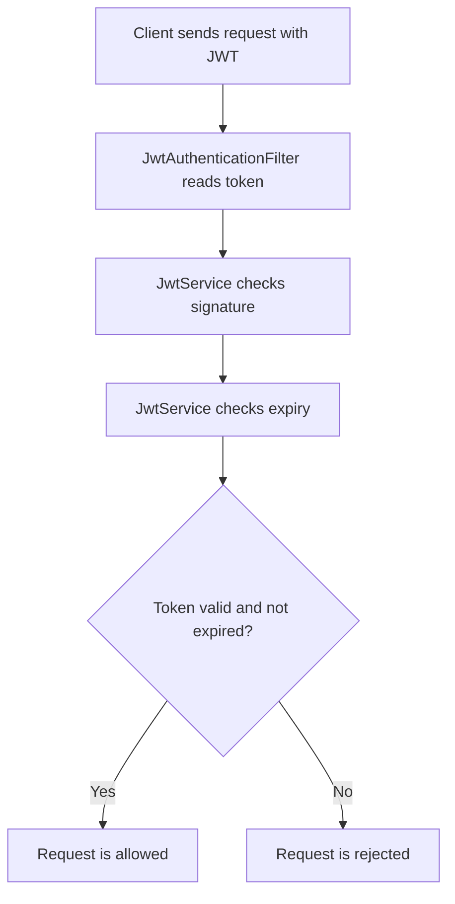
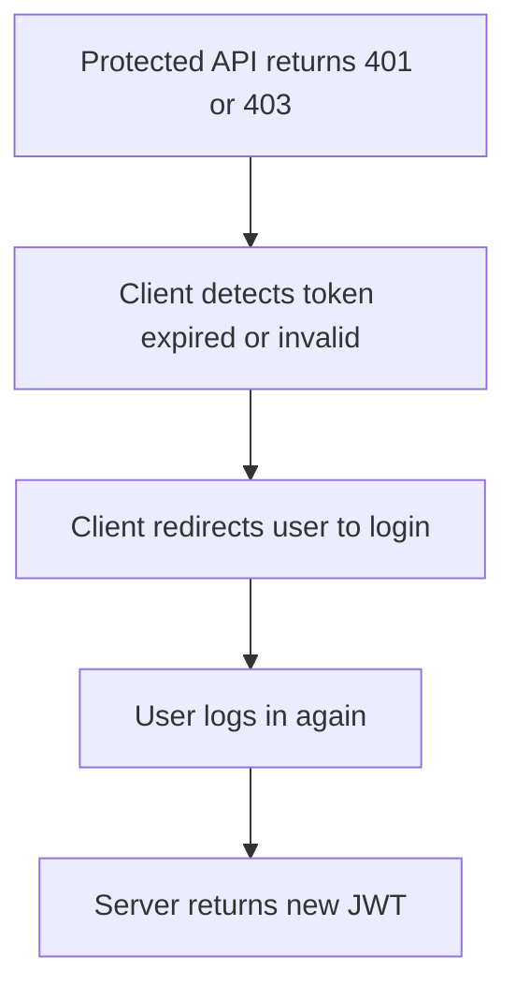

# JWT Authentication Flow

This document explains the high-level JWT flow used by this Spring Boot REST API PoC.

## Contents

- [Introduction To JWT](#introduction-to-jwt)
- [What Problem Does JWT Solve?](#what-problem-does-jwt-solve)
- [Why JWT Was Needed](#why-jwt-was-needed)
- [What Is Inside A JWT?](#what-is-inside-a-jwt)
- [JWT Library Vs Application Code](#jwt-library-vs-application-code)
- [Registration Flow](#registration-flow)
- [Login Flow](#login-flow)
- [After Login / Protected API Flow](#after-login--protected-api-flow)
- [Scenario-Based Understanding](#scenario-based-understanding)

## Introduction To JWT

JWT stands for JSON Web Token.

A JWT is a compact token format used to safely pass identity-related information between a client and a server. In authentication systems, the server creates a JWT after a user successfully logs in. The client then sends that token on later API calls to prove that it is already authenticated.

Example:

```http
Authorization: Bearer jwt-token-here
```

JWTs are commonly used in REST APIs because REST APIs are usually stateless. Stateless means the server does not need to store a server-side session for every logged-in user.

## What Problem Does JWT Solve?

Before token-based authentication, many web applications used server-side sessions.

In a session-based system:



This works well, but it can become harder to scale when there are many servers, mobile apps, SPAs, or external clients. Every request may require a session lookup, and multiple servers need a shared way to find session data.

JWT solves this by putting signed identity information inside the token itself.

In a JWT-based system:



The server can validate the token without storing every login session in memory.

## Why JWT Was Needed

JWT became popular because modern applications often have many different types of clients:

- Web frontends built with React, Angular, Vue, or similar frameworks
- Mobile apps
- Backend-to-backend API consumers
- Microservices
- Third-party integrations

These clients need a simple way to call protected APIs without sending username and password every time.

JWT provides that mechanism:

- The user authenticates once.
- The server returns a signed token.
- The client sends the token with future API calls.
- The server verifies the token before allowing access.

## What Is Inside A JWT?

A JWT is an encoded token with three parts: header has metadata, payload has claims, and signature proves the token was not modified.

```text
header.payload.signature
```

Example shape:

```text
xxxxx.yyyyy.zzzzz
```

### Header

The header usually contains metadata such as the signing algorithm.

Example:

```json
{
  "alg": "HS256",
  "typ": "JWT"
}
```

### Payload

The payload contains claims. Claims are pieces of information about the user or token.

Example:

```json
{
  "sub": "learner@example.com",
  "userId": 1,
  "name": "Learning User",
  "iat": 1710000000,
  "exp": 1710001800
}
```

Common claims:

| Claim | Meaning |
| --- | --- |
| `sub` | Subject, usually the user identifier |
| `iat` | Issued at time |
| `exp` | Expiry time |
| `iss` | Issuer |
| `aud` | Audience |

### Signature

The signature proves that the token was created by a trusted server and was not modified.

If someone changes the payload, the signature validation fails.

Important: JWT payload is encoded, not encrypted. Do not put passwords, secrets, API keys, or sensitive private data inside a JWT.

## JWT Library Vs Application Code

In Java/Spring Boot, JWT creation and validation logic is usually integrated by us, but the low-level JWT operations are provided by a library.

In this PoC, we use the JJWT library:

```gradle
implementation 'io.jsonwebtoken:jjwt-api:0.12.6'
runtimeOnly 'io.jsonwebtoken:jjwt-impl:0.12.6'
runtimeOnly 'io.jsonwebtoken:jjwt-jackson:0.12.6'
```

The JWT library provides methods to:

- Create JWTs
- Sign JWTs
- Parse JWTs
- Validate token signatures
- Read claims
- Check token expiry

Example token creation from this PoC:

```java
String token = Jwts.builder()
        .subject(user.getEmail())
        .claim("userId", user.getId())
        .claim("name", user.getName())
        .issuedAt(Date.from(now))
        .expiration(Date.from(expiresAt))
        .signWith(secretKey)
        .compact();
```

Here, `subject`, `issuedAt`, and `expiration` are standard/default JWT claims, while `userId` and `name` are custom claims added by this application.

The `compact()` method returns the final JWT as an encoded string, not as raw JSON. Inside that token string, there are three parts: header, payload, and signature. The payload part represents JSON claims such as `sub`, `userId`, `name`, `iat`, and `exp`. The client sends this token string in the `Authorization` header, and the server decodes and validates it when processing protected requests.

Example token validation from this PoC:

```java
Claims claims = Jwts.parser()
        .verifyWith(secretKey)
        .build()
        .parseSignedClaims(token)
        .getPayload();
```

But the application still decides:

- When to create a token
- What claims to put inside the token
- Token expiry time
- Which signing key to use
- How to read `Authorization: Bearer <token>`
- What to do if the token is invalid or expired
- How to load the user from the database
- Which APIs are public and which APIs are protected

So the library handles JWT mechanics, while our Spring Boot code handles the authentication flow.

## Problems JWT Helps Solve

JWT helps with:

- Stateless API authentication
- Avoiding username/password on every request
- Authentication for mobile apps and single-page applications
- Authentication across distributed systems
- Passing user identity between services
- Reducing dependency on server-side session storage

JWT does not automatically solve every security problem. Applications still need HTTPS, strong secrets, short token expiry, proper authorization checks, and safe token storage.

## Registration Flow



### Registration Request

```http
POST /api/auth/register
Content-Type: application/json
```

```json
{
  "name": "Learning User",
  "email": "learner@example.com",
  "password": "Password123"
}
```

### Registration Response

```json
{
  "user": {
    "id": 1,
    "name": "Learning User",
    "email": "learner@example.com"
  },
  "accessToken": "jwt-token-here",
  "tokenType": "Bearer",
  "expiresInMinutes": 30
}
```

## Login Flow



### Login Request

```http
POST /api/auth/login
Content-Type: application/json
```

```json
{
  "email": "learner@example.com",
  "password": "Password123"
}
```

### Login Response

```json
{
  "user": {
    "id": 1,
    "name": "Learning User",
    "email": "learner@example.com"
  },
  "accessToken": "jwt-token-here",
  "tokenType": "Bearer",
  "expiresInMinutes": 30
}
```

## After Login / Protected API Flow



### Protected API Request

```http
GET /api/auth/me
Authorization: Bearer jwt-token-here
```

or:

```http
GET /api/todos
Authorization: Bearer jwt-token-here
```

## Key Idea

Registration and login both return a JWT access token.

After login, the client does not send the email and password again. Instead, it sends the JWT in the `Authorization` header:

```http
Authorization: Bearer jwt-token-here
```

The backend validates the token signature and expiry. If the token is valid, Spring Security treats the request as authenticated and allows access to protected APIs.

## Scenario-Based Understanding

### Scenario 1: Does The User Send Email And Password Every Time?

No.

The user sends email and password only during authentication operations:

- Registration: `POST /api/auth/register`
- Login: `POST /api/auth/login`

After login, the user should not send the password again for every API call. Instead, the client sends the JWT access token.

Example:

```http
GET /api/todos
Authorization: Bearer jwt-token-here
```

This is safer because the password is not repeatedly transmitted with every request.

### Scenario 2: When Is A JWT Created?

In this PoC, a JWT is created when the user successfully registers or logs in.



The JWT is not automatically created again for every protected API request.

### Scenario 3: Is A New JWT Created For Every Subsequent Request?

No.

For normal protected API calls, the same JWT is reused until it expires.



Example:

```http
GET /api/auth/me
Authorization: Bearer same-jwt-token
```

```http
GET /api/todos
Authorization: Bearer same-jwt-token
```

The backend validates the same token on each request. It does not issue a replacement token unless the application is designed to do that.

### Scenario 4: What Happens On Every Protected Request?

For every protected request, the server checks the JWT.



The server does not trust the token just because it exists. It verifies that:

- The token was signed by this server using the configured secret.
- The token was not modified.
- The token has not expired.
- The user mentioned in the token still exists.

### Scenario 5: What If The Token Is Valid But Expired?

If the token has a valid signature but is expired, the request is rejected.

The token may still be structurally correct and signed correctly, but expiry means it is no longer acceptable for authentication.

Expected result:

```http
HTTP/1.1 401 Unauthorized
```

or depending on Spring Security handling:

```http
HTTP/1.1 403 Forbidden
```

In this PoC, the JWT validation checks expiry inside `JwtService`. If the token is expired, authentication is not added to the Spring Security context, so the protected controller is not allowed to run.

### Scenario 6: What Should The Client Do When Token Expires?

In this simple PoC, the client should ask the user to log in again.



In real production systems, applications often use refresh tokens:

- Access token: short-lived token used for API calls.
- Refresh token: longer-lived token used to get a new access token.

This PoC keeps the flow simple and does not implement refresh tokens.

### Scenario 7: What If Someone Changes The JWT?

If someone changes even one character in the JWT, the signature validation fails.

Result:

```http
HTTP/1.1 401 Unauthorized
```

or:

```http
HTTP/1.1 403 Forbidden
```

That is why JWTs are trusted only after signature verification.

### Scenario 8: What If The User Logs In Again?

If the user logs in again, the server creates a new JWT.

The old JWT may still work until it expires, unless the application implements token revocation or session tracking.

This PoC does not store issued tokens in the database, so it does not revoke older tokens automatically.

### Scenario 9: Can The Server Logout A JWT User Immediately?

Not automatically in this simple stateless design.

JWT authentication is usually stateless:

- The server creates a token.
- The client stores it.
- The server validates it on each request.
- The server does not remember every issued token.

Because of that, logout is usually handled by the client deleting the token.

For immediate server-side logout, a production application can add:

- Token blacklist
- Token version stored on the user
- Short access token expiry
- Refresh token rotation
- Server-side session records

## Quick Scenario Summary

| Question | Answer |
| --- | --- |
| Does the user send email/password every time? | No. Only during login/register. |
| What is sent after login? | `Authorization: Bearer <jwt-token>` |
| Is a JWT created for every API call? | No. The same token is reused until expiry. |
| When is a new JWT created? | On login/register, or refresh-token flow if implemented. |
| What if the token is expired? | Request is rejected. User must login again in this PoC. |
| What if the token is modified? | Signature validation fails and request is rejected. |
| Does this PoC implement refresh tokens? | No. It keeps the learning flow simple. |

## Main Classes In This PoC

- `AuthController`: handles registration, login, and current user profile.
- `JwtService`: creates JWTs and validates token signature/expiry.
- `JwtAuthenticationFilter`: reads the bearer token from incoming requests.
- `SecurityConfig`: configures public and protected endpoints.
- `TodoController`: sample protected REST API.
