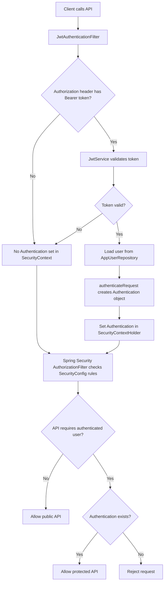

# Java JWT REST API PoC

This is an end-to-end Spring Boot REST application for learning JWT authentication.

## Stack

- Java 17
- Spring Boot 3
- Spring Security
- JJWT for token creation and validation
- `ConcurrentHashMap` as a simple in-memory PoC database
- Gradle from `C:\Gradle`

## API Flow

1. Register a user with `POST /api/auth/register`.
2. Login with `POST /api/auth/login`.
3. Copy the returned `accessToken`.
4. Send protected requests with `Authorization: Bearer <accessToken>`.
5. The JWT filter validates the token and loads the authenticated user.

## Authentication Flow In Code



Class responsibilities:

| Class | Responsibility |
| --- | --- |
| `AuthController` | Handles register and login |
| `JwtService` | Creates JWT and validates token signature/expiry |
| `JwtAuthenticationFilter` | Reads `Authorization: Bearer <token>` and authenticates request |
| `SecurityContextHolder` | Stores authenticated user for the current request |
| `SecurityConfig` | Defines public APIs and protected APIs |
| Spring Security `AuthorizationFilter` | Enforces `SecurityConfig` rules |
| `AppUserRepository` | Stores and loads users from the in-memory map |

Important point:

```text
Token validation only proves the JWT is valid.
authenticateRequest() tells Spring Security that the current request is authenticated.
If the Authorization header is missing, JwtAuthenticationFilter does not authenticate the request. For protected APIs, Spring Security AuthorizationFilter rejects it because SecurityConfig requires authentication.
```

## Run

```powershell
C:\Gradle\bin\gradle.bat run
```

The API starts on:

```text
http://localhost:8080
```

## Try With Curl

Register:

```powershell
curl.exe -X POST http://localhost:8080/api/auth/register `
  -H "Content-Type: application/json" `
  -d "{\"name\":\"Learning User\",\"email\":\"learner@example.com\",\"password\":\"Password123\"}"
```

Sample response:

```json
{
  "user": {
    "id": 1,
    "name": "Learning User",
    "email": "learner@example.com"
  },
  "accessToken": "jwt-token-here",
  "tokenType": "Bearer",
  "expiresInMinutes": 30
}
```

Login:

```powershell
curl.exe -X POST http://localhost:8080/api/auth/login `
  -H "Content-Type: application/json" `
  -d "{\"email\":\"learner@example.com\",\"password\":\"Password123\"}"
```

Copy the `accessToken` from register or login response:

```powershell
$token = "PASTE_ACCESS_TOKEN_HERE"
```

Create protected todo:

```powershell
curl.exe -X POST http://localhost:8080/api/todos `
  -H "Content-Type: application/json" `
  -H "Authorization: Bearer $token" `
  -d "{\"title\":\"Understand JWT flow\"}"
```

List protected todos:

```powershell
curl.exe http://localhost:8080/api/todos `
  -H "Authorization: Bearer $token"
```

## Important Files

- `src/main/java/com/example/jwtpoc/security/SecurityConfig.java` configures Spring Security.
- `src/main/java/com/example/jwtpoc/security/JwtAuthenticationFilter.java` reads and validates bearer tokens.
- `src/main/java/com/example/jwtpoc/security/JwtService.java` creates and verifies JWTs.
- `src/main/java/com/example/jwtpoc/auth/AuthController.java` handles register and login.
- `src/main/java/com/example/jwtpoc/todo/TodoController.java` is a protected sample business API.
- `src/main/java/com/example/jwtpoc/user/AppUserRepository.java` stores users in a `ConcurrentHashMap`.
- `src/main/java/com/example/jwtpoc/todo/TodoRepository.java` stores todos in a `ConcurrentHashMap`.

## Security Notes

- The JWT secret in `application.yml` is only for local learning.
- Use a long random secret from environment variables in real applications.
- Use HTTPS in production.
- Access tokens should be short-lived.
- Production systems usually add refresh tokens, revocation, audit logs, and account lockout rules.
