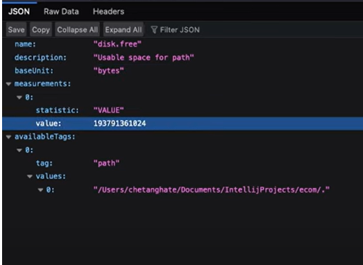

# Spring Interiew preparation

## What is Spring?
Spring is an open source framework which helps in depelopment of java application. It is known for its IOC (inversion of control), DI (Dependency injection) and AOP (aspect oriented programming) features.

## What is Inversion of control (IOC)?
In this object creation and its lifecycle is managed by container and not by the application code.

## What is Dependency Injection (DI)?
Dependency Injection is a design pattern in which spring container creates and injects object into the bean object. It can be constructor injection, setter injection, field injection using @Autowired annotation

- Constructor injection is usually preferred for mandatory dependencies.
- Setter injection is often used for optional or changeable dependencies.
- Field injection is optional injection.

```java
import org.springframework.beans.factory.annotation.Autowired;
import org.springframework.stereotype.Component;

@Component
public class Car {

    private Engine engine;             // Constructor injection
    private Transmission transmission; // Setter injection

    @Autowired
    private Wheels wheels;            // Field injection

    // Constructor injection
    @Autowired
    public Car(Engine engine) {
        this.engine = engine;
    }

    // Setter injection
    @Autowired
    public void setTransmission(Transmission transmission) {
        this.transmission = transmission;
    }

    public void startCar() {
        engine.start();
        transmission.shift();
        wheels.rotate();
        System.out.println("Car started successfully!");
    }
}
```
```java
import org.springframework.stereotype.Component;

@Component
public class Engine {
    public void start() {
        System.out.println("Engine started.");
    }
}

@Component
public class Transmission {
    public void shift() {
        System.out.println("Transmission shifted.");
    }
}

@Component
public class Wheels {
    public void rotate() {
        System.out.println("Wheels are rotating.");
    }
}
```

## What are the different types of bean scope in spring ?
- Singleton : One instance per spring container (Default)
- Prototype : New instance each time its requested.
- Request : One instance per http request (Web context only)
- session : One instance per http session
- application : One instance is created for an entire web application 
- websocket : One instance per websocket.

```java
import org.springframework.stereotype.Component;
import org.springframework.beans.factory.annotation.Scope;

@Component
public class SingletonBean {
    public SingletonBean() {
        System.out.println("Singleton instance created");
    }
}

@Component
@Scope("prototype")
public class PrototypeBean {
    public PrototypeBean() {
        System.out.println("Prototype instance created");
    }
}

@Component
@Scope("request")
public class RequestScopedBean {
    public RequestScopedBean() {
        System.out.println("Request instance created");
    }
}

@Component
@Scope("session")
public class SessionScopedBean {
    public SessionScopedBean() {
        System.out.println("Session instance created");
    }
}

@Component
@Scope("application")
public class ApplicationScopedBean {
    public ApplicationScopedBean() {
        System.out.println("Application instance created");
    }
}

@Component
@Scope("websocket")
public class WebSocketScopedBean {
    public WebSocketScopedBean() {
        System.out.println("WebSocket instance created");
    }
}
```

## What are the different types of beans in spring?
| Annotation     | Purpose                                    | Layer of Application   |
|----------------|--------------------------------------------|-------------------------|
| `@Component`   | General-purpose Spring bean. This is the base for Service, Repository and Controller beans                | Any layer               |
| `@Service`     | Specilized form of component. Marks class as service bean (service layer contains business logic)       | Service layer           |
| `@Repository`  | Specilized form of component. Marks class as DAO beans (DAO). Automatically converts database exceptions into DataccessException.              | Data access layer (DAO) |
| `@Controller`  | Specilized form of component. Marks class as web controllers (Spring MVC)         | Web controller layer    |
| `@RestController` | Specilized form of controller. Marks class as REST controllers (API endpoints)  | Web API layer           |
| `@Configuration` | Marks class as configuration class which contains bean definitions. | Configuration class |
| `@Autowired`   | Dependency injection                       | Anywhere in the app     |
| `@Value`       | Inject property values                     | Anywhere in the app     |

## @Primary and @Qalifier ?
@Primary Marks a bean as default when multiple beans of same type exist.

@Qualifier specifies which bean to inject. It overrides @Primary.
It is used when you want to inject speific bean by name.

```java
import org.springframework.context.annotation.Bean;
import org.springframework.context.annotation.Configuration;
import org.springframework.context.annotation.Primary;

@Configuration
public class AppConfig {

    @Bean
    @Primary
    public Vehicle car() {
        return new Car();
    }

    @Bean
    public Vehicle bike() {
        return new Bike();
    }
}

import org.springframework.beans.factory.annotation.Autowired;
import org.springframework.beans.factory.annotation.Qualifier;
import org.springframework.stereotype.Component;
@Component
public class TransportService {

    // Injects the car (because it's @Primary)
    @Autowired
    private Vehicle defaultVehicle;

    // Injects the bike (overrides @Primary)
    @Autowired
    @Qualifier("bike")
    private Vehicle specificVehicle;
}
```

## What are the different annotations used at REST controller layer in Spring?

| Annotation         | Description |
|--------------------|-------------|
| `@RestController`  | Marks the class as a REST controller (`@Controller` + `@ResponseBody`) |
| `@RequestMapping`  | Maps HTTP requests to controller methods (can be used at class or method level) |
| `@GetMapping`      | Shortcut for `@RequestMapping(method = RequestMethod.GET)` |
| `@PostMapping`     | Shortcut for `@RequestMapping(method = RequestMethod.POST)` |
| `@PutMapping`      | Shortcut for `@RequestMapping(method = RequestMethod.PUT)` |
| `@DeleteMapping`   | Shortcut for `@RequestMapping(method = RequestMethod.DELETE)` |
| `@PatchMapping`    | Shortcut for `@RequestMapping(method = RequestMethod.PATCH)` |
| `@RequestBody`     | Binds the HTTP request body to a method parameter object |
| `@ResponseBody`    | Sends the method return value directly in the HTTP response (usually as JSON) |
| `@PathVariable`    | Binds a path parameter to a method parameter |
| `@RequestParam`    | Binds a query parameter to a method parameter|
| `@RequestHeader`   | Binds a value from the request header to a method parameter |
| `@ResponseStatus`  | Sets the HTTP status code for the response |
| `@ExceptionHandler`| Handles exceptions at the controller level |
| `@CrossOrigin`     | Enables Cross-Origin Resource Sharing (CORS) |
| `@Valid` / `@Validated` | Triggers validation on incoming request body or params |

```java
package com.example.demo.controller;

import com.example.demo.model.User;
import com.example.demo.service.UserService;
import jakarta.validation.Valid;
import org.springframework.beans.factory.annotation.Autowired;
import org.springframework.http.HttpStatus;
import org.springframework.http.ResponseEntity;
import org.springframework.validation.annotation.Validated;
import org.springframework.web.bind.annotation.*;

import java.util.List;

@RestController
@RequestMapping("/api/users")
@CrossOrigin(origins = "*") // Allow requests from any domain
//@CrossOrigin(origins = "http://example.com") allows requests only from http://example.com"
public class UserController {

    @Autowired
    private UserService userService;

    // GET: /api/users?id=1
    @GetMapping
    public ResponseEntity<User> getUserById(@RequestParam Long id) {
        return ResponseEntity.ok(userService.findById(id));
    }

    // GET: /api/users/5
    @GetMapping("/{userId}")
    public ResponseEntity<User> getUser(@PathVariable Long userId) {
        return ResponseEntity.ok(userService.findById(userId));
    }

    // POST: /api/users
    //@ResponseBody Here we dont need this annotation as we are using @RestController annotation. IT is the combination of @controller and @ResponseBody annotation.
    @PostMapping
    @ResponseStatus(HttpStatus.CREATED)
    public User createUser(@Valid @RequestBody User user) {
        return userService.save(user);
    }

    // PUT: /api/users/5
    //@valid annotation will be used to check all conditions present inside User class. It might be @NotNull etc.
    @PutMapping("/{id}")
    public ResponseEntity<User> updateUser(@PathVariable Long id, @Valid @RequestBody User updatedUser) {
        return ResponseEntity.ok(userService.update(id, updatedUser));
    }

    // DELETE: /api/users/5
    @DeleteMapping("/{id}")
    @ResponseStatus(HttpStatus.NO_CONTENT)
    public void deleteUser(@PathVariable Long id) {
        userService.delete(id);
    }

    // When any controller methods throws this 'UserNotFoundException' exception for example from service then this method will catch that and it will excute following code.
    @ExceptionHandler(UserNotFoundException.class)
    public ResponseEntity<String> handleNotFound(UserNotFoundException ex) {
        return new ResponseEntity<>(ex.getMessage(), HttpStatus.NOT_FOUND);
    }
}
```
```java
package com.example.demo.model;

import com.fasterxml.jackson.annotation.JsonProperty;
import jakarta.validation.constraints.NotBlank;

//As we are using @RequestBody annotation on controller we dont need it here
public class User {

    private Long id;

    @NotBlank(message = "Name is mandatory")
    private String name;

    // Getters and Setters
}
```
## Spring bean configuration types?
- XML based approach
- Java based approach
- Hybrid approach

### XML approach
This is the old approach to configure beans. In this case beans are defined in beans.xml or applicationContext.xml file.

Follwoing is the example of beans.xml where we are defining signle-single beans.
```java
package com.example;

public class UserRepository {

    public UserRepository() {
        System.out.println("UserRepository instance created!");
    }

    public void save() {
        System.out.println("UserRepository save method called.");
    }
}


package com.example;

public class UserService {

    // The variable name here does not have to match the bean ID
    private UserRepository userRepository;

    // Setter injection for UserRepository
    public void setUserRepository(UserRepository userRepository) {
        this.userRepository = userRepository;
    }

    public void process() {
        System.out.println("UserService process method called.");
        userRepository.save();  // Calls save method of the singleton UserRepository
    }
}
```
```java
<beans xmlns="http://www.springframework.org/schema/beans"
       xmlns:xsi="http://www.w3.org/2001/XMLSchema-instance"
       xsi:schemaLocation="http://www.springframework.org/schema/beans
                           http://www.springframework.org/schema/beans/spring-beans.xsd">

    <!-- Defining the userRepository bean with singleton scope -->
    <bean id="userRepository" class="com.example.UserRepository" scope="singleton" />

    <!-- Defining the userService bean with prototype scope -->
    <bean id="userService" class="com.example.UserService" scope="prototype">
        <property name="userRepository" ref="userRepository" />
    </bean>

</beans>
```
We should avoid defining beans one by one in beans.xml file. It will make the file bulky. Instead we should use annotations like @Controller, @Service etc. on individual classes and give the package path to beans.xml to load all these beans.

We can use 'component-scan' and provide package name to it. Then it will scan all the beans from that path.

```java
<?xml version="1.0" encoding="UTF-8"?>
<beans xmlns="http://www.springframework.org/schema/beans"
       xmlns:xsi="http://www.w3.org/2001/XMLSchema-instance"
       xsi:schemaLocation="http://www.springframework.org/schema/beans
                           http://www.springframework.org/schema/beans/spring-beans.xsd"
       xmlns:context="http://www.springframework.org/schema/context"
       xmlns:mvc="http://www.springframework.org/schema/mvc">

    <!-- Enable component scanning to detect annotations like @RestController and @Service -->
    <context:component-scan base-package="com.example.demo" />

</beans>
```

### Java based approach
We can use java class annoted with @Configuration annotation.

Follwoing is the example where we are defining signle-single beans.

```java
package com.example.demo.service;

public class UserService {

    public String getUserName(Long id) {
        return "User " + id;
    }
}


package com.example.demo.controller;

import com.example.demo.service.UserService;

public class UserController {

    private final UserService userService;

    // Constructor injection
    public UserController(UserService userService) {
        this.userService = userService;
    }

    public String getUser(Long id) {
        return userService.getUserName(id);
    }
}
```
```java
package com.example.demo.config;

import com.example.demo.controller.UserController;
import com.example.demo.service.UserService;
import org.springframework.context.annotation.Bean;
import org.springframework.context.annotation.Configuration;

@Configuration  // This marks the class as a configuration class
public class AppConfig {

    // Defining the UserService bean manually
    @Bean
    public UserService userService() {
        return new UserService();  // Instantiate the UserService bean
    }

    // Defining the UserController bean manually
    @Bean
    public UserController userController() {
        return new UserController(userService());  // Inject UserService into the UserController
    }
}
```

We should avoid defining beans one by one in configuration class. It will make the class bulky. Instead we should use annotations like @Controller, @Service etc. on individual classes and give the package path to configuration class to load all these beans.

We can use 'component-scan' and provide package name to it. Then it will scan all the beans from that path.
```java
package com.example.demo.config;

import org.springframework.context.annotation.ComponentScan;
import org.springframework.context.annotation.Configuration;

@Configuration  // Marks this as a configuration class
@ComponentScan(basePackages = "com.example.demo")  // Scans the given package for Spring components
public class AppConfig {
    // Spring will automatically register the beans defined in the specified package
}
```
## What is ApplicationContext in spring?
It is a container which creates and manages bean lifecycle. Provides methods to retrieve beans.

## What are the widely used Application context implementations?
- ClassPathXmlApplicationContext : Used for xml based configuration
- AnnotationConfigApplicationContext : Used for annotation based configuration.
```java
package com.example;

import com.example.service.UserService;
import org.springframework.context.ApplicationContext;
import org.springframework.context.support.ClassPathXmlApplicationContext;
import org.springframework.context.annotation.AnnotationConfigApplicationContext;
import com.example.config.AppConfig;

public class App {
    public static void main(String[] args) {
        // Load XML-based context
        ApplicationContext xmlContext = new ClassPathXmlApplicationContext("beans.xml");

        // Load Java-based context
        ApplicationContext javaContext = new AnnotationConfigApplicationContext(AppConfig.class);

        // Retrieve the UserRepository bean from the XML context
        UserRepository userRepository = (UserRepository) xmlContext.getBean("userRepository");

        // Retrieve the UserService bean from the Java context
        UserService userService = javaContext.getBean(UserService.class);

        // Set the UserRepository in UserService using setter injection
        userService.setUserRepository(userRepository);

        // Use the service to create a user
        userService.createUser("John Doe");

        // Close the contexts
        ((ClassPathXmlApplicationContext) xmlContext).close();
        ((AnnotationConfigApplicationContext) javaContext).close();
    }
}
```

## What is Aspect Oriented Programming (AOP)?
Aspect Oriented Programming allows us to seperate cross-cutting conserns from main business logic.

Cross-cutting conserns are the code which affect multiple part of application code.

So if we dont use AOP then we will have to write same code in multiple locations like logging code, security code etc along with business logic.

With the help of AOP we can seperate out these cross cutting code into single place.

Common examples of cross-cutting concerns:
- Logging
- Security / Authentication / Authorization
- Error handling
- Performance monitoring / Metrics
- Transaction management
- Caching
- Validation

### Key concepts of AOP
- Aspect : Aspect is class which contains cross-cutting conserns like logging, error handling etc.
    - We can use @Order(1) to set the order in case multiple aspects are present.
- Advice : Advice is a method which gets executed at a specific join point. This method contains cross cutting code. Advice is a part of aspect class.

| **Advice Type**      | **When It Runs**                                       |
|----------------------|--------------------------------------------------------|
| `@Before`            | Before method execution                                |
| `@After`             | After method finishes (whether it returns or throws)   |
| `@AfterReturning`    | After method returns successfully                      |
| `@AfterThrowing`     | If the method throws an exception                      |
| `@Around`            | Around the method execution (before + after + control) |

- Join Point : Join point is a specific point during execution of a program, like method call or exception, where aspect's advice can be applied.
```java
@Aspect
@Component
public class JoinPointDemoAspect {

    @Before("execution(* com.example.service.MyService.*(..))")
    //The JoinPoint object is a snapshot of the execution context at the point where the advised method is invoked
    public void beforeAdvice(JoinPoint joinPoint) {
        System.out.println("🔹 @Before: Method = " + joinPoint.getSignature().getName());
        System.out.println("🔹 Args = " + Arrays.toString(joinPoint.getArgs()));
    }

    @After("execution(* com.example.service.MyService.*(..))")
    public void afterAdvice(JoinPoint joinPoint) {
        System.out.println("🔹 @After: Completed method = " + joinPoint.getSignature().getName());
    }

    @AfterReturning(
        pointcut = "execution(* com.example.service.MyService.*(..))",
        returning = "result"
    )
    public void afterReturningAdvice(JoinPoint joinPoint, Object result) {
        System.out.println("🔹 @AfterReturning: Method = " + joinPoint.getSignature().getName());
        System.out.println("🔹 Returned = " + result);
    }

    @AfterThrowing(
        pointcut = "execution(* com.example.service.MyService.*(..))",
        throwing = "ex"
    )
    public void afterThrowingAdvice(JoinPoint joinPoint, Exception ex) {
        System.out.println("🔹 @AfterThrowing: Method = " + joinPoint.getSignature().getName());
        System.out.println("🔹 Exception = " + ex.getMessage());
    }
}
```
```java
//ProceedingJoinPoint only meant for Around advice.
@Around("execution(* com.example.service.MyService.sayHello(..))")
public Object aroundAdvice(ProceedingJoinPoint joinPoint) throws Throwable {
    System.out.println("🌀 @Around: Method = " + joinPoint.getSignature().getName());
    Object[] args = joinPoint.getArgs();
    // Optionally modify args here
    Object result = joinPoint.proceed(args);
    System.out.println("🌀 @Around: Result = " + result);
    return result;
}

```
- Pointcut : Pointcut is a rule to define which joinpoint to intercept.
    - execution pointcut 
    - @annotation pointcut
```
Structure of execution pointcut expression :

execution(access-modifier-pattern? return-type-pattern classNameOrInterface-name-pattern? method-name-pattern(param-pattern) throws-pattern?)

option1 : 
//Most specific expresion to intercept exact same method.
execution(public String com.example.aopdemo.service.MyService.sayHello(String) throws java.lang.Exception)

option2:
//As access modifier is optional we will only add only one star before class name for return type.
execution(* com.example.aopdemo.service.MyService.sayHello(..) throws *)

option3:
//Here we are providing only mandatory regex i.e. only for ReturnType, MethodName and MethodParameter. This expresssion will intercept all the methods in application.
execution(* *(..))

option4:
//This expression will intercept all methods in service package. This is widely used and realistic expression.
execution(* com.example.aopdemo.service.*(..))
```

Example of annotation pointcut :
```java

//Creating custom annotation
@Target(ElementType.METHOD)
@Retention(RetentionPolicy.RUNTIME)
public @interface LoggingAspect {
}


@Service
public class MyService {

    @LoggingAspect
    public void doSomething() {
        System.out.println("Doing something...");
    }
}


@Aspect
@Component
public class MyAspect {

    @Before("@annotation(MyCustomAspect)")
    public void beforeAdvice(JoinPoint joinPoint) {
        System.out.println("Before method: " + joinPoint.getSignature().getName());
    }
}
```

- Weaving : Weaving is the process of applying aspects to application code either during compile time or run time .

### Example of AOP :
```java
package com.example.aopdemo.service;

import org.springframework.stereotype.Service;

@Service
public class MyService {

    //This is the joinpoint. advices will be applied before, after etc as per defined in aspect class.
    public String sayHello(String name) {
        System.out.println("Inside sayHello()");
        if (name.equals("error")) {
            throw new RuntimeException("Simulated error");
        }
        return "Hello, " + name;
    }
}
```
```java
package com.example.aopdemo.aspect;

import org.aspectj.lang.ProceedingJoinPoint;
import org.aspectj.lang.annotation.*;
import org.springframework.stereotype.Component;

//LoggingAspect is a Aspect
//In Spring Aspects are managed by container thats why need to add @component otherwise spring will not recognise
@Aspect
@Component
@Order(1)
public class LoggingAspect {

    //beforeAdvice is a advice method because it is annoted with @Before 
    //Following is the pointcut expression : execution(* com.example.aopdemo.service.MyService.sayHello(..))
    @Before("execution(* com.example.aopdemo.service.MyService.sayHello(..))")
    public void beforeAdvice() {
        System.out.println("@Before: Method is about to run");
    }

    @After("execution(* com.example.aopdemo.service.MyService.sayHello(..))")
    public void afterAdvice() {
        System.out.println("@After: Method has finished (success or exception)");
    }

    //returning = "result" this name should match with method afterReturningAdvice parameter name.
    @AfterReturning(pointcut = "execution(* com.example.aopdemo.service.MyService.sayHello(..))", returning = "result")
    public void afterReturningAdvice(Object result) {
        System.out.println("@AfterReturning: Method returned – " + result);
    }

    @AfterThrowing(pointcut = "execution(* com.example.aopdemo.service.MyService.sayHello(..))", throwing = "ex")
    public void afterThrowingAdvice(Exception ex) {
        System.out.println("@AfterThrowing: Exception thrown – " + ex.getMessage());
    }

    //In this we have to call proceed method to execute method.
    //Around advice gets ProceedingJoinPoint method argument by default.
    @Around("execution(* com.example.aopdemo.service.MyService.sayHello(..))")
    public Object aroundAdvice(ProceedingJoinPoint joinPoint) throws Throwable {
        //Do some processing before method execution
        System.out.println("@Around: Before method");

        // Proceed with method execution
        Object result = joinPoint.proceed();

        //Do some processing after method execution
        System.out.println("@Around: After method");
        return result;
    }
}
```
## What is JPA ?
JPA (Java Persistence API) is a speciication for ORM (Object Relational Mapping).

It provides a standard way to map java objects to relational databases.

Basically it provides interfaces and annotations that ORM providers must implement.

## What is Hibernate ?
Hibernate is the ORM framework and one of the most used implementation of JPA. It provides libraries to map java classes to database tables. 

It provides features like database connections, SQL generation, caching, lazy loading and more.

## List of JPA Implementations?
- Hibernate
- Eclipse Link

## What is Spring Data JPA?
Spring Data JPA is an abstraction layer written on top of JPA specification.

It uses hibernate under the hood as implementation. This implementation we can change with other JPA implementations.

It simplifies data access layer. Reduces boiler plate code and complex queries to write manually

## List of Interfaces in Spring JPA
1. Repository<T, ID>   
It is a marker interface that other repository interfaces extends.
org.springframework.data.repository.Repository

2. CrudRepository<T, ID>   
It provides basic CRUD operations but does not include sorting or pagination functionality.
org.springframework.data.repository.CrudRepository

3. PagingAndSortingRepository<T, ID>   
It extends CRUD repository. It provides additional methods for pagination and sorting.
Method : findAll(Pageable pageable)
         findAll(Sort sort)
org.springframework.data.repository.PagingAndSortingRepository

4. JpaRepository<T, ID>
It extends PagingAndSortingRepository and CRUDRespository. It also provides methods to flush persistence context and bach operations.
org.springframework.data.jpa.repository.JpaRepository

## CrudRepository Method Summary

| Method Signature                                             | Description                                                       |
|--------------------------------------------------------------|-------------------------------------------------------------------|
| `S save(S entity)`                                           | Saves a given entity (create or update).                          |
| `Iterable<S> saveAll(Iterable<S> entities)`                  | Saves multiple entities. (create or update)                       |
| `Optional<T> findById(ID id)`                                | Finds an entity by its ID.  (read)                                |
| `Iterable<T> findAllById(Iterable<ID> ids)`                  | Returns all entities by their IDs.  (read)                        |
| `Iterable<T> findAll()`                                      | Returns all entities.  (read)                                     |
| `boolean existsById(ID id)`                                  | Returns `true` if an entity with the given ID exists.  (read)     |
| `long count()`                                               | Returns the number of entities.  (read)                           |
| `void delete(T entity)`                                      | Deletes the given entity. (delete)                                |
| `void deleteById(ID id)`                                     | Deletes the entity with the given ID.  (delete)                   |
| `void deleteAllById(Iterable<? extends ID> ids)`             | Deletes entities by the given IDs. (Since Spring Data 2.5)(delete)|
| `void deleteAll(Iterable<? extends T> entities)`             | Deletes the given entities.  (delete)                             |
| `void deleteAll()`                                           | Deletes all entities.    (delete)                                 |


## PagingAndSortingRepository Method Summary

| Method Signature                             | Description                                                                 |
|----------------------------------------------|-----------------------------------------------------------------------------|
| `Iterable<T> findAll(Sort sort)`             | Returns all entities sorted by the given `Sort` parameter.                 |
| `Page<T> findAll(Pageable pageable)`         | Returns a paginated list of entities according to the `Pageable` parameter. |


## JpaRepository Specific Methods

| Method Signature                                         | Description                                                             |
|----------------------------------------------------------|-------------------------------------------------------------------------|
| `void flush()`                                           | Flushes all pending changes to the database.                            |
| `T saveAndFlush(T entity)`                               | Saves an entity and immediately flushes changes to the DB.              |
| `List<T> saveAllAndFlush(Iterable<T> entities)`          | Saves all entities and flushes. (Since Spring Data 2.5)                 |
| `void deleteAllInBatch()`                                | Deletes all entities in one batch.                                     |
| `void deleteAllInBatch(Iterable<T> entities)`            | Deletes given entities in a batch. (Since Spring Data 2.5)              |
| `T getOne(ID id)`                                        | Lazy-load reference to entity. **Deprecated** in favor of `getById()`. |
| `T getById(ID id)`                                       | Returns a reference to the entity with the given ID.                    |

## What is difference between @Repository and JPARepository?
- Repository annotation is just another annotation like @service, @component etc.
- It helps spring container to regester a class as bean.
- It logically marks class as data access layer (Repository layer).
- On the other hand JPARepository provides CRUD operation and other features.
If we use JPARepository we dont need to write all those boiler plate code. It gets injected automatically in runtime.
- If we are extending JPARepository then we dont need to add @Repository annotation on class. Spring will automatically scan for JPARepository and it will inject that.

## When to use @Repository and JPARepository?
- If we want to do custom operations that cant be handled by default methods of JPARepository then we should use @Repository without JPARepository. In this case we need to work with entity manager direcly.
- If we have requirement that can be handled by JPARepository then we can use JPARepository without @Repository annotation. Spring will automatically inject this inservice class. Here we dont need to wory about entity manager.

Example of @Repository:
```java
import org.springframework.stereotype.Repository;
import javax.persistence.EntityManager;
import javax.persistence.PersistenceContext;
import javax.persistence.TypedQuery;
import java.util.List;

@Repository  // Marks this as a Spring bean
public class BookRepository {

    @PersistenceContext  // Injects the EntityManager for interacting with the database
    private EntityManager entityManager;

    // Custom query method
    public List<Book> findBooksByAuthor(String author) {
        // JPQL query to find books by author
        String jpql = "SELECT b FROM Book b WHERE b.author = :author";
        TypedQuery<Book> query = entityManager.createQuery(jpql, Book.class);
        query.setParameter("author", author);
        return query.getResultList();
    }

    // You can add other custom methods as needed
}


import org.springframework.beans.factory.annotation.Autowired;
import org.springframework.stereotype.Service;
import java.util.List;

@Service
public class BookService {

    private final BookRepository bookRepository;

    @Autowired
    public BookService(BookRepository bookRepository) {
        this.bookRepository = bookRepository;
    }

    public List<Book> getBooksByAuthor(String author) {
        // Use the custom query method directly
        return bookRepository.findBooksByAuthor(author);
    }

    // You can add other service methods as needed
}
```

Example of JPARepository
```java
import javax.persistence.Entity;
import javax.persistence.Id;

@Entity
public class Book {

    @Id
    private Long id;
    private String title;
    private String author;

    // Constructors, Getters, and Setters

    public Book() {}

    public Book(Long id, String title, String author) {
        this.id = id;
        this.title = title;
        this.author = author;
    }

    public Long getId() {
        return id;
    }

    public void setId(Long id) {
        this.id = id;
    }

    public String getTitle() {
        return title;
    }

    public void setTitle(String title) {
        this.title = title;
    }

    public String getAuthor() {
        return author;
    }

    public void setAuthor(String author) {
        this.author = author;
    }
}
```
```java
import org.springframework.data.jpa.repository.JpaRepository;

public interface BookRepository extends JpaRepository<Book, Long> {
    // You can define custom query methods if needed
    // Spring will automatically inject implementation for this new method. variable name should match with entityname e.g author is valirable name so method name will be findByAuthor
    List<Book> findByAuthor(String author);
}
```
```java
import org.springframework.beans.factory.annotation.Autowired;
import org.springframework.stereotype.Service;

import java.util.List;
import java.util.Optional;

@Service
public class BookService {

    private final BookRepository bookRepository;

    @Autowired
    public BookService(BookRepository bookRepository) {
        this.bookRepository = bookRepository;
    }

    // Create or Update a Book
    public Book saveBook(Book book) {
        return bookRepository.save(book);
    }

    // Get all Books
    public List<Book> getAllBooks() {
        return bookRepository.findAll();
    }

    // Get Book by ID
    public Optional<Book> getBookById(Long id) {
        return bookRepository.findById(id);
    }

    // Get Books by Author (Custom method)
    public List<Book> getBooksByAuthor(String author) {
        return bookRepository.findByAuthor(author);
    }

    // Delete Book by ID
    public void deleteBookById(Long id) {
        bookRepository.deleteById(id);
    }

    // Delete a Book (using Book entity object)
    public void deleteBook(Book book) {
        bookRepository.delete(book);
    }

    // Delete all Books
    public void deleteAllBooks() {
        bookRepository.deleteAll();
    }
}
```

## Spring JPA example for Employee having list of subordinates in it
```java
package com.example.demo.controller;

import com.example.demo.model.Employee;
import com.example.demo.service.EmployeeService;
import org.springframework.web.bind.annotation.*;

import java.util.List;

@RestController
@RequestMapping("/api/employees")
public class EmployeeController {

    private final EmployeeService service;

    public EmployeeController(EmployeeService service) {
        this.service = service;
    }

    @PostMapping
    public Employee createEmployee(@RequestBody Employee employee) {
        return service.saveEmployee(employee);
    }

    @GetMapping("/{id}")
    public Employee getEmployeeById(@PathVariable Long id) {
        return service.getEmployeeById(id);
    }

    @GetMapping
    public List<Employee> getAllEmployees() {
        return service.getAllEmployees();
    }

    @GetMapping("/manager/{managerId}")
    public List<Employee> getEmployeesByManager(@PathVariable Long managerId) {
        return service.getEmployeesByManager(managerId);
    }
}
```
```java
package com.example.demo.service;

import com.example.demo.model.Employee;
import com.example.demo.repository.EmployeeRepository;
import org.springframework.stereotype.Service;

import java.util.List;

@Service
public class EmployeeService {

    private final EmployeeRepository repository;

    public EmployeeService(EmployeeRepository repository) {
        this.repository = repository;
    }

    public Employee saveEmployee(Employee employee) {
        return repository.save(employee);
    }

    public Employee getEmployeeById(Long id) {
        return repository.findById(id).orElse(null);
    }

    public List<Employee> getAllEmployees() {
        return repository.findAll();
    }

    public List<Employee> getEmployeesByManager(Long managerId) {
        return repository.findByManagerId(managerId);
    }
}
```
```java
package com.example.demo.repository;

import com.example.demo.model.Employee;
import org.springframework.data.jpa.repository.JpaRepository;
import java.util.List;

public interface EmployeeRepository extends JpaRepository<Employee, Long> {
    List<Employee> findByManagerId(Long managerId);
}
```
```java
import javax.persistence.*;

@Entity
@Table(name = "employee")  // Specifies the name of the table in the database
public class Employee {

    @Id
    @GeneratedValue(strategy = GenerationType.IDENTITY)
    private Long id;  // Employee's unique identifier (primary key)

    @Column(name = "employee_name", nullable = false, length = 100)
    private String name;   // Employee's name (mapped to "employee_name" column)

    @Column(name = "job_position", nullable = false, length = 50)
    private String position;  // Employee's job position (mapped to "job_position" column)

    @ManyToOne(fetch = FetchType.LAZY)  // Each employee has one manager (self-referencing relationship)
    @JoinColumn(name = "manager_id")   // Foreign key column in Employee table
    private Employee manager;  // The manager of the employee (another Employee object)

    // One-to-many relationship: A manager can have many subordinates
    //mappedBy field 'manager' will be searched inside List<Employee> class to find relationship. This manager field contains joinColumn attribute.
    @OneToMany(mappedBy = "manager", cascade = CascadeType.ALL, fetch = FetchType.LAZY)
    private List<Employee> subordinates;  // Subordinates of this manager

    @Column(name = "salary", nullable = false)
    private Double salary;  // Employee's salary (mapped to "salary" column)

    // Getters and Setters
    public Long getId() {
        return id;
    }

    public void setId(Long id) {
        this.id = id;
    }

    public String getName() {
        return name;
    }

    public void setName(String name) {
        this.name = name;
    }

    public String getPosition() {
        return position;
    }

    public void setPosition(String position) {
        this.position = position;
    }

    public Employee getManager() {
        return manager;
    }

    public void setManager(Employee manager) {
        this.manager = manager;
    }

    public Double getSalary() {
        return salary;
    }

    public void setSalary(Double salary) {
        this.salary = salary;
    }
}
```
```java
//cascading explaination

Employee manager = new Employee();
manager.setName("Alice");

Employee emp1 = new Employee();
emp1.setName("Bob");
emp1.setManager(manager);

Employee emp2 = new Employee();
emp2.setName("Charlie");
emp2.setManager(manager);

manager.setSubordinates(List.of(emp1, emp2));
employeeRepository.save(manager); // Only saving manager

//Thanks to cascade = CascadeType.ALL, 
// JPA will automatically save Bob and Charlie too! 


// Without cascade, you’d have to manually save each subordinate as follows:
employeeRepository.save(manager);
employeeRepository.save(emp1);
employeeRepository.save(emp2);
```

| id  | name    | position   | manager_id |
|-----|---------|------------|------------|
| 1   | Alice   | Manager    | NULL       |
| 2   | Bob     | Developer  | 1          |
| 3   | Charlie | Developer  | 1          |
| 4   | David   | Developer  | 2          |

```
SELECT e.id, e.name, e.position, m.name AS nameOfManager
FROM employee e
LEFT JOIN employee m ON e.manager_id = m.id;
```

Note: We use JoinColumn on ManyToOne attribute. Not on OneToMany. On OneToMany we use mappedBy.

Example 1 :
```java
    // Example of self join i.e. Both manage and subordinates are exmployee only. i.e. Employee class.
    @ManyToOne(fetch = FetchType.LAZY)  
    @JoinColumn(name = "manager_id")
    private Employee manager; 

    @OneToMany(mappedBy = "manager", cascade = CascadeType.ALL, fetch = FetchType.LAZY)
    private List<Employee> subordinates; 
```

Example 2 :
```java
    //One teacher has many students.

    //Teacher entity 
    @OneToMany(mappedBy = "teacher", cascade = CascadeType.ALL, fetch = FetchType.LAZY)
    private List<Student> students;

    //Many students have 1 teacher

    //Student entity
    @ManyToOne(fetch = FetchType.LAZY)
    @JoinColumn(name = "teacher_id")
    private Teacher teacher;
```
### Teachers

| id  | name        |
|-----|-------------|
| 1   | Mr. Smith   |
| 2   | Ms. Johnson |

### Students

| id  | name     | teacher_id |
|-----|----------|------------|
| 1   | Alice    | 1          |
| 2   | Bob      | 1          |
| 3   | Charlie  | 2          |

## How to provide database and other properties in spring JPA ?
src/main/resources/application.properties
```java
# Oracle Database configuration
spring.datasource.url=jdbc:oracle:thin:@localhost:1521:xe
spring.datasource.username=your_oracle_username
spring.datasource.password=your_oracle_password
spring.datasource.driver-class-name=oracle.jdbc.OracleDriver

# JPA and Hibernate configuration
spring.jpa.hibernate.ddl-auto=update
spring.jpa.show-sql=true
//Following is a class which will be used by hibernate to generate SQL query for oracle db
spring.jpa.properties.hibernate.dialect=org.hibernate.dialect.Oracle12cDialect
```

## Do we need persistence.xml ?
No. Spring boot auto configures for us.
- Entity manager
- Transaction manager
- Data source
- Dialect
- Package scanning
- Persistence unit

## Cache Types in JPA/Hibernate

### First-Level Cache
- The First-Level Cache is managed by the EntityManager itself, and it is session-bound (or transaction-scoped). This cache is local to the EntityManager instance and persists only for the duration of a single transaction or session.
- Once the transaction is committed or the EntityManager is closed, the First-Level Cache is cleared.
- Primary purpose: It reduces the number of database queries within the same transaction/EntityManager.

### Second-Level Cache
- The Second-Level Cache is managed by the EntityManagerFactory in collaboration with a cache provider (e.g., EhCache, Infinispan, Hazelcast, etc.).
- Unlike the First-Level Cache, which is tied to a specific EntityManager, the Second-Level Cache is shared across multiple EntityManager instances and across multiple sessions/transactions.
- Primary purpose: It improves performance across transactions by avoiding repeated queries to the database.

## Cache Comparison Table

| **Feature**                     | **First-Level Cache (EntityManager)**                                    | **Second-Level Cache (EntityManagerFactory)**                               |
|----------------------------------|----------------------------------------------------------|------------------------------------------------------|
| **Scope**                        | Per **`EntityManager`** (session/transaction-scoped)      | **Global** (shared across multiple `EntityManager` instances) |
| **Enabled by default?**          | Yes                                                      | No (must be explicitly enabled)                      |
| **Cache expiration**             | Expires when **`EntityManager`** is closed               | Can be configured with expiration and eviction policies |
| **Scope of Use**                 | Only during the lifecycle of a transaction or session    | Across transactions and application-level, shared by all `EntityManager`s |
| **Default Configuration**        | Automatic (no setup required)                            | Needs setup and configuration (e.g., cache provider) |
| **Used for**                     | Caching entities within the current session or transaction. It means if transaction is done then no more caching. For new Transaction again fetched from DB. | Caching entities across sessions and transactions    |


## If we have two data sources then how many EntityManagerFactory and EntityManager objects should be there?

- Two EntityManagerFactory instances, one for each data source.
- Two EntityManager instances, one for each data source, created for each transaction.

## What is persistence context ?
We can think persistence context as cache (First level and sencon level).

## What is the role of the @Cacheable annotation in Spring?
It caches result of a method if second level cache is enabled.

```java
@Service
public class ProductService {

    @Cacheable(value = "productsCache", key = "#productId")
    public Product getProductById(Long productId) {
        return productRepository.findById(productId);
    }
}

```

## @Cache ?
When we enable second level cache like ehcache then this annotations tell cacheing framework about entites which needs to be cached.

It check if primary key of given entity is present in cache or not. If its present then it returns result from cache else it fetches data from database and stores it in cache.

```java
@Entity
@Cache(usage = CacheConcurrencyStrategy.READ_WRITE)
public class Product {

    @Id
    private Long id;

    private String name;
    private Double price;
}

```

## What is Spring Boot ?
Spring boot is a framework used to simplify spring devolopment and deployment process.

It provides built in production ready features like
- Embedded tomcat server.
- auto configurations

With the help of which we can create standlone spring applications.

## Spring boot features ?
- Auto configuration : Automatically configures beans based on classpath and other configuration files.
- Embedded Servers : Supports embedded servers like tomcat, jetty. Elementes need to deploy war file.
- Spring boot starters : Starters contains pre-configures dependencies which simplifies inclusion of required dependencies.
- Spring boot actuators : Helps in health checks, metrix and monitoring.
- Minimal configuration : Reduces boiler plate code and configuration.

## What is the purpose of @SpringBootApplication annotation
It is the combinaton of :
- @Configuration : Marks the class as a source of bean definitions.
- @EnableAutoConfiguration : Enables spring boots autoconfiguration.
- @ComponentScan : Enable component scan and scan current package.

## What is the role of application.properties or application.yml in Spring Boot?
To provide external configurations.

## What is profile and How do you set up profiles in Spring Boot?
Profiles allows environment specific configurations like dev env, prod env etc.

We can set current profile  using :
spring.profiles.active=dev

## What is Spring Boot's autoconfiguration?
It automatically configures beans present in class path. 

Example : IF spring boot finds 'spring-boot-starter-data-jpa' then it automatically configures EntityManagerFactory and other beans.

This feature is enabled by @enableAutoConfiguration and it is part of @springBootApplication.

## How do you disable auto-configuration in Spring Boot?
We can exclude bean class that we dont want.
@SpringBootApplication(exclude = {DataSourceAutoConfiguration.class})

## How to change embedded server ?
We can change embedded server from default tomcat to jetty by adding required dependency in pom.

<dependency>
    <groupId>org.springframework.boot</groupId>
    <artifactId>spring-boot-starter-jetty</artifactId>
</dependency>


## How do you configure the port for an embedded server?

application.properties or application.yml using:
```
server.port=8081
```

## How can you handle exceptions globally in spring boot ?
Spring Boot provides the @ControllerAdvice annotation to handle exceptions globally. You can define a class with @ControllerAdvice and use @ExceptionHandler methods to handle specific exceptions.
```java
@ControllerAdvice
public class GlobalExceptionHandler {

    @ExceptionHandler(ResourceNotFoundException.class)
    public ResponseEntity<String> handleResourceNotFound(ResourceNotFoundException ex) {
        return new ResponseEntity<>("Resource not found", HttpStatus.NOT_FOUND);
    }
}
```

##  What is the use of @Value annotation in Spring Boot?
@Value is used to inject property value from application.properties or application.yml file.
```
@Value("${server.port}")
private String serverPort;
```

## What is @ConfigurationProperties ?
It is used when we want to map any pojo class with external properties present in application.properties or yml
```java
@Component
@ConfigurationProperties(prefix = "myapp")
public class MyAppProperties {
    private String name;
    private int timeout;

    // Getters and setters
}


@Service
public class AppService {
    private final MyAppProperties props;

    public AppService(MyAppProperties props) {
        this.props = props;
    }

    public void printConfig() {
        System.out.println("App: " + props.getName());
    }
}

```

applicaiton.properties
```
myapp:
  name: AwesomeApp
  timeout: 45
```

## What is Spring Boot Actuator?
Spring boot actuator provides production ready features like health checks, metrics, environment information. It contains set of tools to monitor and manage spring boot application.

To enable actuator add following dependency in pom.xml
```
<dependency>
    <groupId>org.springframework.boot</groupId>
    <artifactId>spring-boot-starter-actuator</artifactId>
</dependency>
```

By default only following endpoints are active :
```
/actuator
/actuator/health
/actuator/health/{path}
```

If we want to active other endpoints of actuator then we need to add following property in application.properties.
```
management.endpoint.web.expose.include=*    *This property will activate all other 14 endpoints of actuators*
management.endpoint.web.expose.include=beans,mappings     *This will expose only beans and mappings endpoint*
```
Please note by default endpoints are accessible via application's port i.e. 8080. If we want to change this port to seperate application and management endpoints then we can add following in application.properties.
```
management.port=9001 
```

### Lits of actuator endpoints
- /actuator/beans : Out of of this will be json. This will contain all the beans in application.
- /actuator/caches : It will list all the caches present in application. If we have cached any JPA entity and any other model then it will show all that with name.
- /actuator/caches/{cache} : It will fetch only given cache name
- /actuator/health : It will show status of application.
- /actuator/info : It will show information of application that we have provided inside application.properties like name, owner, build info etc
- /actuator/configprops : It will list all the config property beans on which @configurationProperty is mentioned.
- /actuator/env : It will show active profile like dev, prod, uat etc.
- /actuator/loggers : It will list all the loggers in application
- /actuator/heapdump : It will start downloading (.hprof file) heapdump of application. This heapdump we can load in any tool like Jprofiler or intellij(if have ultimate license)
- /actuator/threaddump : It will show current stacktrace of application. It will show all the threads along with its state.
- /actuator/metrics : It will list all the available metrics names like 

- /actuator/metrics/{metricsId} : It will show details of given metrics like

- /actuator/mapppings : It will show all rest endpoint present in application.


### How to enable or disable any actuator enpoint ?
In application.properties
```
management.endpoint.info.enable=false/true 
```

## Performance and actuator
Using actuator like heapdump and all can hamper performace. So in production env we should enable only required endpoints. That too we should rarely use. 

## Prometheus / Grafana
It is used for long term metrics collection and visualization of an application. We should use this instead of actuator like metrics.

Grafana is for data visualization and monitoring i.e. provides dashboard and prometheus is to store time series data.

Prometheous store data like like CPU usage, memory utilization, request latencey and error rate. 

Please note prometheous itself is data source.

## What is a Spring Boot Banner?
Spring boot banner is a custom logo that comes on console when we start spring boot application.
We can disable it adding following property in application.properties.
```
spring.main.banner-mode=off
```