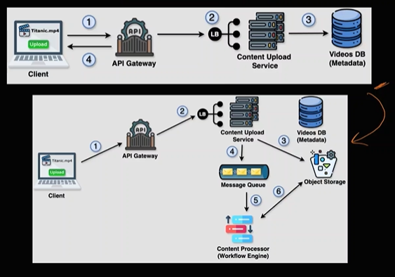

# System Design

## Framework for System Design
1. Deciding requirements - 
    * Functional : What should system do. Example, If we are designing youtube then user can upload and stream videos.

    * Non-Functional : 'How well?' system performs like Reliability, Scalability, Speed. Example, In case of youtube if user uploading video then latency matters. If streaming video then availability matters. It should handle 100M users etc. All this comes under non functional.

2. Capacity Estimation -  
    In this we decide how many servers will be thers, how many databases, caches will be there.
    Following things to consider for capacity estimation :
    * Daily Active Users (DAU)/Monthly Active Users (MAU)
    * Throughput : Here we calculate how may requests system can process per second. 
    * Storage/Memeory : How much storage or memory system will need.
    * Network/Bandwidth : Here we calculate how much data moves in and out of our system. Example, Consider throughput is 100Million and each request consists of 10mb then we will need (100M * 10mb) netowork/bandwidth per second.

3. API Design -  
    Here we write functional requirements more technically. It consists of 3 major parts :
    * Endpoint : It is a door to specific part to your system
    * Request : Input to your system
    * Response : Output from your system
    ```
    API design to upload video

    Endpoint : POST /videos
    Request : {
        "file" : "System-Design-Course.mp4",
        "title" : "System Design Course",
        "tags" : ["system", "Design"]
    }
    Response : {
        "videoId" : "12345",
        "status" : "SUCCESS"
    }
    
4. High Level Design (HLD) -  
    Here we draw different components of system and link between them.
    

5. Deep Dive -  
Here we discuss system in more detail like Database selection, Database modeling, Caches or perticular section of the system design. Example,  In can of youtube we can deep dive on what database we can select to store videos etc.

## Some basic concepts
### Load Balancer
- If multipe API gateways are present then request first comes to load balancer. 
- Then it decides where to route this request i.e. if multiple API gateways are present then it decides on which instance request should be routed based on load on that API gateway.
- In case if no API gateway is present then it directly routs request to end microservice.

### API Gateway
- API gateway decides which microservice this request should be forwarded based on url, methods etc.
- If multiple instances are present of single microservice (scaling) then it sends requets to load balancer then load balancer sends that request to available instance of microservice.
- API gateway is also useful for following cross-cutting conserns
    - Authentication and Authorization : Checks if user is authenticated and authrized or not.
    - Rate limiting : Ensures client doesn't exeed allowed requests limit.
    - Request aggreegtion : It can call mutiple microservises and can combine response of those microservices and return it to the client.

### Example 
Suppose we have 3 microservices 'order', 'payment', 'profile'. Having URL as '/order' , '/payment', '/profile' repectively. Each having multiple instances running. More than 1 API gateways.

So when client will make a request it will go in follwoing sequence :
 Client -> Load Balancer -> API Gateway - > Load Balancer -> Microservice

 Reqponse sequence :
 Microservice -> Load Balancer -> API Gateway -> Load Balancer -> Client

 Here Load balancer gets the request first then it decides which API gateway to route this request if multiple available. Then API gatway decides where to route this using request url i.e. if '/order' then route it to order microservice and so on. If multiple instance of order service then again request comes to load balancer of order microservice then it routs it to available instance of order microservice.

Note: If single api gateway is present then no need for load balancer to call api gateway. Also if single instance of microservice is present then no need to call load balancer. Api gateway can directly call end microsevice. 