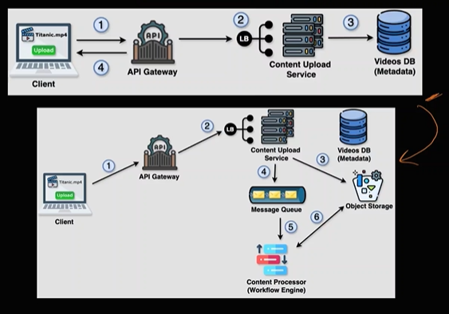

# System Design

## Framework for System Design
1. Deciding requirements - 
    * Functional : What should system do. Example, If we are designing youtube then user can upload and stream videos.

    * Non-Functional : 'How well?' system performs like Reliability, Scalability, Speed. Example, In case of youtube if user uploading video then latency matters. If streaming video then availability matters. It should handle 100M users etc. All this comes under non functional.

2. Capacity Estimation -  
    In this we decide how many servers will be thers, how many databases, caches will be there.
    Following things to consider for capacity estimation :
    * Daily Active Users (DAU)/Monthly Active Users (MAU)
    * Throughput : Here we calculate how may requests system can process per second. 
    * Storage/Memeory : How much storage or memory system will need.
    * Network/Bandwidth : Here we calculate how much data moves in and out of our system. Example, Consider throughput is 100Million and each request consists of 10mb then we will need (100M * 10mb) netowork/bandwidth per second.

3. API Design -  
    Here we write functional requirements more technically. It consists of 3 major parts :
    * Endpoint : It is a door to specific part to your system
    * Request : Input to your system
    * Response : Output from your system
    ```
    API design to upload video

    Endpoint : POST /videos
    Request : {
        "file" : "System-Design-Course.mp4",
        "title" : "System Design Course",
        "tags" : ["system", "Design"]
    }
    Response : {
        "videoId" : "12345",
        "status" : "SUCCESS"
    }
    
4. High Level Design (HLD) -  
    Here we draw different components of system and link between them.
    

5. Deep Dive -  
Here we discuss system in more detail like Database selection, Database modeling, Caches or perticular section of the system design. Example,  In can of youtube we can deep dive on what database we can select to store videos etc.